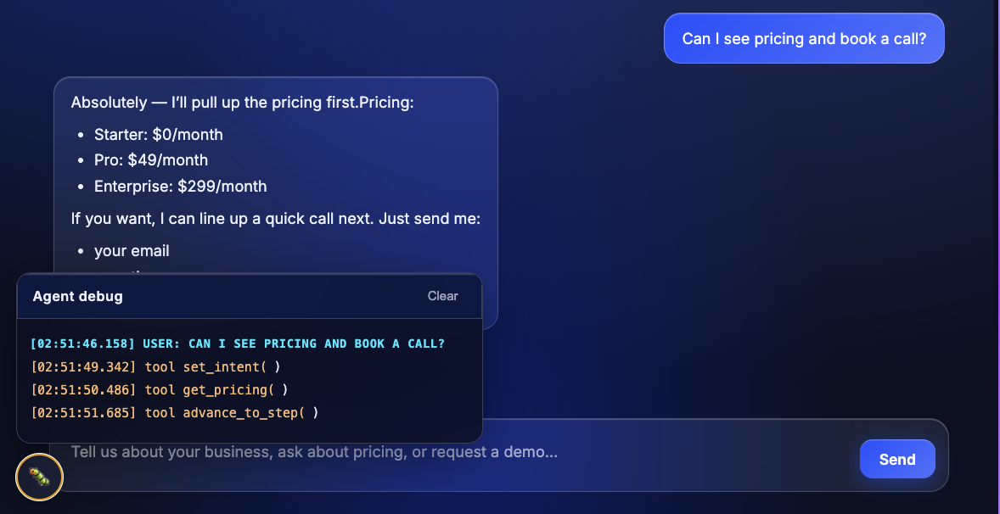
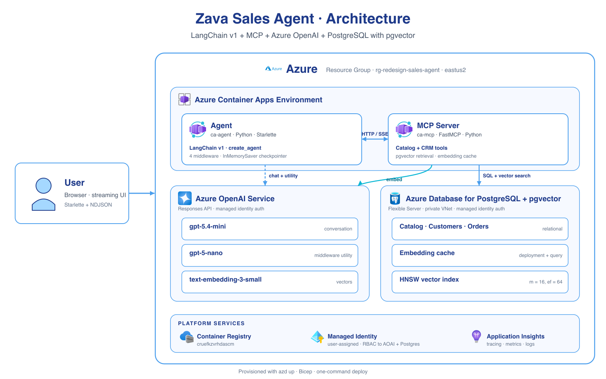
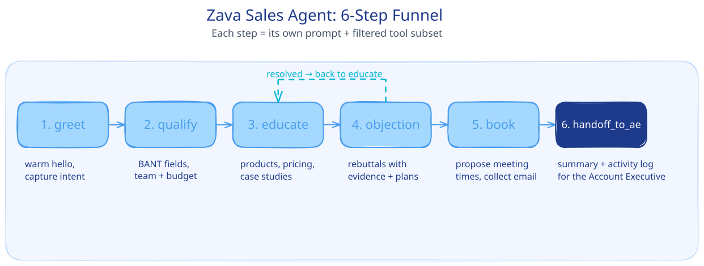

<!-- YAML front-matter schema: https://review.learn.microsoft.com/en-us/help/contribute/samples/process/onboarding?branch=main#supported-metadata-fields-for-readmemd -->

# LangChain Sales Agent (Responses API + MCP)

A Python sample that shows how to build a **multi-step sales agent** with [LangChain v1](https://python.langchain.com/) and [Azure OpenAI](https://docs.langchain.com/oss/python/integrations/chat/azure_chat_openai) that drive sales through a 6-step funnel using the [handoffs pattern](https://docs.langchain.com/oss/python/langchain/multi-agent/handoffs-customer-support). The agent grounds it's responses in data stored in a [Postgres](https://www.postgresql.org/) database with [pgvector](https://github.com/pgvector/pgvector) for semantic search. The database is deployed as an [Model Context Protocol](https://modelcontextprotocol.io/) (MCP) server, that exposes several tools the agent can use to quickly access data. Since the agent is using the Responses API, it can easily connect to MCP servers and comes with several build in tools like a code interpreter and image genration. [Get started now](#quick-start).




[](https://codespaces.new/Azure-Samples/langchain-agent-python)

## What you'll learn

- How to use LangChain's [Handoff]() pattern for multistep tasks.
- How to use Middleware in LangChain to refine the users query, manage context and validate response groundedness. (`gpt-5.4-mini` will power the main agent and middleware tasks will use `gpt-5-nano`)
- How to back retrieval with **Postgres + pgvector**: HNSW indexes over `text-embedding-3-small` vectors for case studies, KB articles, and the product catalogue.
- How to expose **CRM-style tools** as MCP tools with [FastMCP](): `search_case_studies`, `search_kb_articles`, `get_pricing`, `compare_plans` — over streamable HTTP.
- How to use **Entra ID (Managed Identity)** for keyless auth to Azure OpenAI and Postgres.


## Architecture

The core LangChain Agent and the PostgreSQL MCP server are deployed independently as two Container Apps:



The agent is the only public-facing service. The MCP server is reachable only from inside the Container Apps environment. All Azure access uses a user-assigned managed identity with RBAC to Azure OpenAI and PostgreSQL.

## The 6-step sales funnel

Each step is a small system prompt plus a filtered tool subset. The agent moves between steps by calling state-mutating tools (`set_intent`, `advance_to_step`, `back_to_greet`, `escalate_to_ae`):



The state machine lives in [`agent/app/middleware/steps.py`](agent/app/middleware/steps.py); the per-step prompts are plain text in [`agent/app/prompts/`](agent/app/prompts/).

## Prerequisites

- An Azure subscription. [Create one for free](https://azure.microsoft.com/free/).
- [Azure Developer CLI (`azd`)](https://learn.microsoft.com/azure/developer/azure-developer-cli/install-azd).
- [Azure CLI](https://learn.microsoft.com/cli/azure/install-azure-cli).
- Python 3.11+ (only required for local development).
- Docker (only required for the full local stack).

The fastest path is to open the repo in **GitHub Codespaces** — every tool above is preinstalled.

## Quick start

Deploy the app to Azure:

```bash
az login
azd auth login
azd up
```

`azd up` provisions Azure OpenAI (with three model deployments: `gpt-5.4-mini` for the main agent, `gpt-5-nano` for middleware utilities, and `text-embedding-3-small` for vector search), a Postgres Flexible Server with pgvector, a Container Apps environment, and the two container images. After the build finishes a postprovision hook seeds the database with the Zava DIY catalogue (~424 products with pre-computed embeddings) and the sales knowledge base (case studies, pricing plans, KB articles).

**Estimated time:** ~10–15 minutes end-to-end on a fresh subscription. Postgres flexible-server creation is the slowest single step (~5–7 minutes); the model deployments, container builds, and seeding fill the rest.

### Deployment notes

- The default region is `eastus2`. Override with `azd env set AZURE_LOCATION <region>` before `azd up`. The `gpt-5.4-mini` and `gpt-5-nano` deployments need a region that has both available (e.g. `eastus2`, `swedencentral`).
- The postprovision hook adds your current public IP to the Postgres firewall so it can run the seeders. Re-run the hook from a different network with `azd hooks run postprovision`.
- The first `azd up` builds two container images with `uv`. Subsequent `azd deploy <service>` rebuilds for a single service take ~30–60 seconds.

When it finishes you'll see something like:

```text
🚀 Your LangChain Agent is Ready!

🌐 Web chat:   https://ca-agent-<id>.<region>.azurecontainerapps.io/
   Health:     https://ca-agent-<id>.<region>.azurecontainerapps.io/api/health
   MCP Server: https://ca-mcp-<id>.<region>.azurecontainerapps.io/mcp
```

Open the web chat URL and try:

- _Hi, I run a 25-person property management company — do you work with teams like mine?_
- _We're already on Big-Box Pro — why switch?_
- _Can you show me your pricing tiers?_

To remove every resource later, run `azd down`.

## Repository layout

```text
.
├── agent/                       # Public-facing chat service
│   ├── app/
│   │   ├── agent.py             # build_models + build_agent (4-middleware chain)
│   │   ├── main.py              # Starlette app, NDJSON streaming /api/chat
│   │   ├── streaming.py         # Stream-chunk parser (text / tools / images / citations)
│   │   ├── state.py             # SalesState (BANT fields + funnel step)
│   │   ├── middleware/
│   │   │   ├── refine.py        # Pronoun-resolution rewrite via nano model
│   │   │   ├── steps.py         # STEP_CONFIG: per-step prompt + tool subset
│   │   │   └── validate.py      # Groundedness check on educate/objection answers
│   │   ├── tools/
│   │   │   └── workflow.py      # set_intent, update_lead_profile, escalate_to_ae, …
│   │   └── prompts/             # 6 step prompts (greet, qualify, educate, objection, book, handoff_to_ae)
│   └── static/                  # Single-page chat UI
├── mcp/
│   └── app.py                   # 9 MCP tools over Postgres + pgvector + cached embeddings
├── data/
│   ├── generate_database.py     # Seeds the products / orders core schema
│   └── generate_sales_kb.py     # Seeds pricing plans, KB articles, case studies (with embeddings)
├── infra/                       # Bicep templates and parameters used by `azd up`
└── azure.yaml                   # azd service definitions and hooks
```

## How it works

### 1. The agent — middleware chain on a two-tier model

`agent/app/agent.py` builds the agent at startup inside a Starlette `lifespan` hook so the MCP connection, OpenAI credentials, and middleware closures are reused across requests:

```python
main  = ChatOpenAI(model="gpt-5.4-mini", use_responses_api=True, ...)
nano  = ChatOpenAI(model="gpt-5-nano", use_responses_api=True, tags=["nano-utility"])

refine_query      = make_refine_query(nano)
validate_response = make_validate_response(nano)
summariser        = SummarizationMiddleware(model=nano, max_tokens_before_summary=4000)

agent = create_agent(
    model=main,
    tools=LOCAL_TOOLS + mcp_tools,
    state_schema=SalesState,
    middleware=[refine_query, apply_step_config, validate_response, summariser],
    checkpointer=InMemorySaver(),
)
```

Things worth noting:

- **Two-tier model**. The expensive `gpt-5-mini` only runs the user-facing turn; pronoun-resolution, groundedness checks, and summarisation use the cheap `gpt-5-nano`. Every nano call is tagged with `nano-utility` so the chat UI can suppress its tokens from the visible bubble.
- **`apply_step_config`** is the heart of the funnel. On every model call it reads `state["current_step"]`, swaps in that step's system prompt, and filters `request.tools` down to the tools the step actually allows. The model can only call what the step exposes.
- **`validate_response`** runs in `educate` and `objection` only. It looks for `[doc-id]` citations in the assistant's answer and rewrites ungrounded answers to ask the user whether to escalate to a human AE — instead of silently hallucinating pricing or case studies.
- **`use_responses_api=True`** opts into Azure OpenAI's Responses API, which lets the model call hosted tools like `code_interpreter` directly. `api_key=token_provider` is a callable that returns a fresh Entra ID bearer token, so there are no API keys anywhere.

### 2. The MCP server — sales-content tools with cached embeddings

`mcp/app.py` uses [FastMCP](https://github.com/jlowin/fastmcp) to expose nine read-only tools to the agent. Each tool corresponds to something a step prompt actually asks for:

| Tool                       | Step that uses it      | Purpose                                                                          |
| -------------------------- | ---------------------- | -------------------------------------------------------------------------------- |
| `get_current_utc_date`     | any                    | Anchors relative dates like _"next Tuesday"_.                                    |
| `get_table_schemas`        | analytics escape hatch | Column definitions for the `retail` schema.                                      |
| `execute_sales_query`      | analytics escape hatch | Read-only ad-hoc SQL. Defence-in-depth: read-only Postgres role + SQL deny-list. |
| `semantic_search_products` | educate                | pgvector cosine search over product descriptions.                                |
| `get_product_details`      | educate                | Full record for one `product_id`.                                                |
| `search_case_studies`      | educate, objection     | Embedded customer stories, optionally filtered by industry / team size.          |
| `search_kb_articles`       | educate, objection     | Embedded FAQ / how-Zava-works articles.                                          |
| `get_pricing`              | educate, objection     | Pricing plan(s) with a `[plan-id]` citation.                                     |
| `compare_plans`            | objection              | Side-by-side feature/price comparison.                                           |

Every embedding lookup goes through an **in-process LRU cache** keyed on `(deployment_name, query_text)` — so repeated `"do you have customers like us?"`-style queries inside a session are free. The deployment name is part of the key so swapping models invalidates the cache automatically.

The agent talks to this server over the `streamable_http` MCP transport — no shared library, just HTTP. That's what makes it easy to swap the MCP server out for one written in any other language.

### 3. Authentication — Entra ID end to end

Every cross-service hop uses Managed Identity:

- The agent's container has a user-assigned identity granted **Cognitive Services User** on the Azure OpenAI account.
- The MCP server's container uses the same identity to authenticate to **Azure Database for PostgreSQL** and to **Azure OpenAI** (for embedding queries).
- There are no client secrets, connection strings with passwords, or API keys committed to the repo or stored in Container Apps env vars.

### 4. Infrastructure — Bicep + `azd`

`infra/main.bicep` provisions everything in a single deployment:

- Azure OpenAI account with two model deployments (chat + embeddings).
- Postgres Flexible Server with `pgvector` enabled and Entra ID auth on.
- Container Apps environment plus two Container Apps (`agent` and `mcp-server`).
- Log Analytics workspace and Application Insights for observability.

`azure.yaml` declares the two services, points them at their Dockerfiles, and registers a `postprovision` hook that creates the `retail` schema, loads the seed JSON files, and regenerates embeddings against whatever embedding model was actually deployed.

## Local development

You have two options. Both assume you've run `azd up` at least once so Azure OpenAI exists.

### Option 1 — Cloud Postgres, local services (recommended)

```bash
# Pull the deployed environment values
azd env get-values > .env.local
echo "MCP_SERVER_URL=http://localhost:8000" >> .env.local

# Terminal 1 — MCP server
cd mcp && source ../.env.local && python app.py

# Terminal 2 — agent
cd agent && source ../.env.local && PORT=8001 python app.py

# Open http://localhost:8001
```

This runs both Python services on your machine but uses the cloud Postgres and Azure OpenAI deployments.

### Option 2 — Full local stack

```bash
docker compose up -d                         # local Postgres + pgvector
cp .env.example .env.local                   # add your Azure OpenAI endpoint
cd data && source ../.env.local && \
  python generate_database.py && \
  python generate_sales_kb.py && \
  python regenerate_embeddings.py            # match embeddings to your deployment
# Then start mcp/ and agent/ as in Option 1
```

VS Code tasks (`Cmd/Ctrl+Shift+P` → _Tasks: Run Task_) are pre-configured for **Start MCP Server**, **Start Agent**, **Start PostgreSQL (Docker)**, and **Initialize Database**.

## Customise it

### Add a new MCP tool

Add a function to `mcp/app.py` and decorate it. The agent will pick it up on the next start, but **the tool will only be visible inside steps that whitelist its name** in `agent/app/middleware/steps.py`:

```python
# mcp/app.py
@mcp.tool(annotations={"title": "Top Categories", "readOnlyHint": True})
async def top_categories(limit: int = 5, ctx: Context = None) -> str:
    """Return the top-selling product categories."""
    ...
```

```python
# agent/app/middleware/steps.py
STEP_CONFIG["educate"]["tools"].add("top_categories")
```

### Change the model

Edit `infra/main.parameters.json`:

```json
{ "openAiModelName": { "value": "gpt-5-mini" } }
```

Use a model that supports the Responses API. Note that not every model supports every hosted tool — check the [Azure OpenAI model matrix](https://learn.microsoft.com/azure/ai-services/openai/concepts/models).

### Adjust agent behaviour

Each funnel step is a separate prompt file under `agent/app/prompts/`. To change how the agent qualifies leads, edit `qualify.txt`. To change which tools that step is allowed to call, edit the corresponding entry in `agent/app/middleware/steps.py`. Redeploy with `azd deploy agent`.

### Future work — WorkIQ MCP integration

The `book` step currently calls `propose_meeting_times` (text-only) and hands the actual calendar booking to the AE on escalation. The natural next step is to wire [Microsoft Work IQ MCP servers](https://learn.microsoft.com/en-us/microsoft-agent-365/tooling-servers-overview) (`mcp_CalendarServer`, `mcp_TeamsServer`, `mcp_MailTools`) as a second `MultiServerMCPClient` entry, so the agent can directly book meetings, pull recent emails about a lead, and check Teams discussions. Work IQ uses delegated OAuth + a Microsoft 365 Copilot license, so the deployment story will need an MSAL.js sign-in on the chat UI to forward a per-request user bearer to the agent.

## Monitoring

```bash
azd monitor                                                                  # opens Application Insights
az containerapp logs show -n <agent-name> -g <rg-name> --follow              # tail logs
```

Application Insights captures every request to `/api/chat`, every MCP tool call, and every Azure OpenAI request, with end-to-end traces.

## Clean up

```bash
azd down
```

This deletes the resource group and every resource provisioned by `azd up`.

## Resources

- [Azure OpenAI Responses API](https://learn.microsoft.com/azure/ai-services/openai/how-to/responses)
- [LangChain](https://python.langchain.com/) and [`langchain-mcp-adapters`](https://github.com/langchain-ai/langchain-mcp-adapters)
- [Model Context Protocol](https://modelcontextprotocol.io/) and [FastMCP](https://github.com/jlowin/fastmcp)
- [Azure Developer CLI](https://learn.microsoft.com/azure/developer/azure-developer-cli/)
- [pgvector](https://github.com/pgvector/pgvector)
- This sample is inspired by the [Microsoft AI Tour WRK540 workshop](https://github.com/microsoft/aitour26-WRK540-unlock-your-agents-potential-with-model-context-protocol) and reuses its product catalogue.

## Contributing

This project welcomes contributions. Most contributions require you to agree to a Contributor License Agreement; see [https://cla.opensource.microsoft.com](https://cla.opensource.microsoft.com).

## License

MIT — see [LICENSE](LICENSE).

---

Questions? Open an issue on [GitHub](https://github.com/Azure-Samples/langchain-agent-python/issues) or read [SUPPORT.md](SUPPORT.md).
